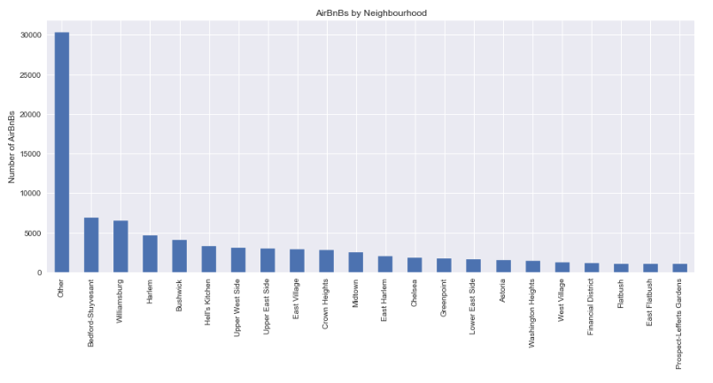
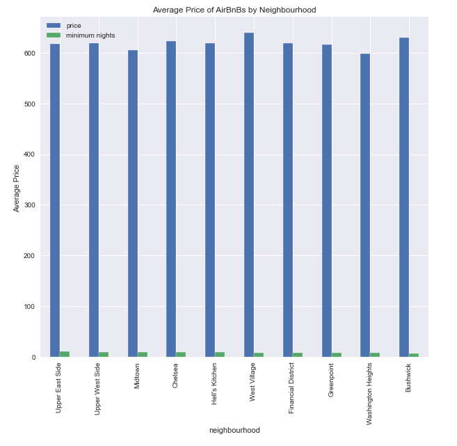
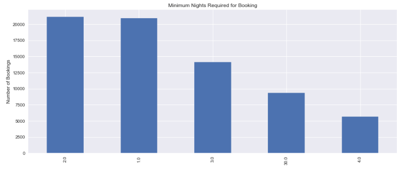

# Predicting the Airbnb Lodgings in New York

**Author**: Alec Hing


## Project Overview

Using a dataset provided by Airbnb, analysis and predictions will be made to understand what effects the total price of an Airbnb. Diving further, questions like, where do people tend to stay most?, how long do they stay there?, does booking at a certain time of year effect price?, where would be the most affordable place to book a Airbnb?,and what is the average price for a stay? will be addressed. Regressor tree models will be used to predict price of future Airbnbs as well. The best model is able to predict an Airbnb price with a RMSE of 39.71. In the end some results were to be expected but some also came with a surprice. It was no surprise that people stayed the longest in Manhattan or that service fees affected the total price the most. But what was surprising to me at least was that Bedford-Stuyvesant was the neighborhood that people stayed at the most. Upper East Side, Astoria, Prospect-Lefferts Gardens, and East Village were the locations that was deemed the most affordable. Finally, people like to stay on average 1-2 nights at Airbnb.

## The Data

The dataset used in this project was found on [Kaggle](https://www.kaggle.com/datasets/arianazmoudeh/airbnbopendata).

The following variables were considered in this analysis:

* 'host_identity_verified'
* 'neighbourhood group'
* 'neighbourhood'
* 'price'
* 'service fee'
* 'minimum nights'
* 'number of reviews'
* 'reviews per month'
* 'review rate number'
* 'calculated host listings count'
* 'availability 365'
* 'lr_year'
* 'lr_month'
* 'lr_day'


## Approach

Important information that needed to be investigated:
* Where do people tend to stay the most?
* How long do stay at an Airbnb?
* Does booking at a certain time of year affect the price?
* Where would be the most affordable place to book an Airbnb?
* What is the average price people spend on an Airbnb?

Answering these questions will help paint a better picture of what people are looking for when they book a lodging and help predict where they most likely will stay in New York.

OLS regression results will help show which variables affect the total price the most and show the average cost for a person. This will also help show which neighborhoods people might want to stay at for a better deal.

Several regressor tree models were used to find the best model that would predict the total price for a stay at a certain place in New York. These models include a basline regerssor model, a random forest model with different interations in its parameters with Grid Search, and a XG Boost model with Grid Search also applied to it.


## Results

Out of the 6 different iteration of models used in this project, the one with the lowest RMSE value was XG Boost. This had a RMSE of about 39.71, meaning the predicted price of an Airbnb would be about 39.71 off from the actual value. The other models had values well over 40. Furthermore, predictably the service fee variable was highly correlated to the total price of an Airbnb.


## Recommendations

To further enhance this model's results, I think one change can be taking into account holidays that are happening around the time of a booking. Another idea could be to apply RegEx to reviews on certain neighborhoods. This could show if people really value a postive review. Finally, taking into account previous reviews of an area can show where people may prefer.
From the actual results of the dataset used, the neighborhoods that show, when booked, lower the total price the most are Upper East Side, Astoria, Prospect-Lefferts Gardens, and East Village. This information can be recommended to the consumer. Furthermore, I would say expect the majority of people booking Airbnbs to book in the Bedford-Stuyvesant (Bed-Stuy) neighborhood since this was shown to be where most people booked their stay. Last, expect people to stay the longest when they book an Airbnb in Manhattan since data suggest this where people have the longest stays. In summary, the neighborhoods in Manhattan and Bed-Stuy show the most interest from people and can be a great opportunity for hosts in that area as well as the company as a whole to profit knowing most people will be booking there.

### Most popular neighborhoods:



Other here represents all combined neighborhoods under 1000 visits.


### Average Price of Airbnb by Neighborhood (Sorted by longest stay)




### Minimum Nights Most People Stay For



## Conclusion

After analyzing this dataset from Airbnb, I got a clearer picture of what customers prefer and what effects the total price. To start off with, here is some general information. The most stayed at neighborhood seemed to be Bedford-Stuyvesant (Bed-Stuy) in Brooklyn. Secondly, some of the most expensive neighborhoods people stay at on average are Flatbush, West Willage, East Flatbush, Prospect-Lefferts Gardens, and Astoria. People tend to stay their longest visits in Upper East Side (11.5) days, Upper West Side, Midtown, Chelsea, and Hell's Kitchen. Building off that, the data suggests that people spend the longest stays in Manhattan on average compared to the rest of New York's boroughs. Speaking of booking, the amount of nights people tend to stay at a location is 1-2 nights. Diving further into the data, a OLS Regression chart was created. From this, it was seen that the average price for an Airbnb amongst customers was $89. The neighborhoods that someone could stay at for a cheaper price are Upper East Side, Astoria, Prospect-Lefferts Gardens, and East Village. Finally, it seems that the service fee for these stays predictably affect the total price the most for an Airbnb. Finally the data was applied to several regressor tree models. Those being a baseline one, random forest with different number of estimators, random forest with a grid search applied, and a XG Boost model with Grid Search. Among these variations, the model with the lowest RMSE was XG Boost with a value of 39.71. From all this data collected, one can say people tend to use Airbnbs to stay in Manhattan and their visits are longer than anywhere else. If one wanted to stay at the most affordable areas, they would want to stay in either Upper East Side, Astoria, Prospect-Lefferts Gardens, and East Village. Finally, the host of these Airbnbs should expect the average person to stay 1-2 nights.


## For More Information

For any additional questions, please contact **Alec @ ahing619@gmail.com**
Full analysis of this project is in a [Jupyter notebook](./ny_borough_prediction.ipynb) or in the [presentation](./Capstone_Presentation.pdf)

## Repository Structure

```
├── data                                <- Sourced externally 
├── images                              <- Created manually 
├── ny_borough_prediction.ipynb         <- Analysis in of this project in Jupyter notebook
├── Capstone_Presentation.pdf           <- Non- Technical PDF version of project presentation
└── README.md                           <- Overview of what this project entails and its results