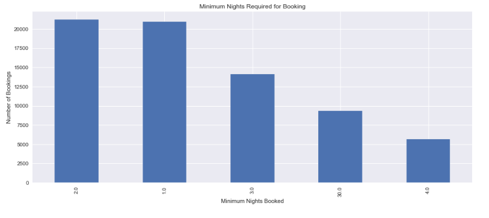
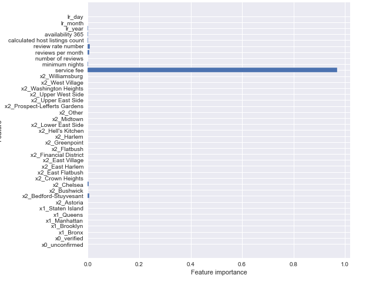
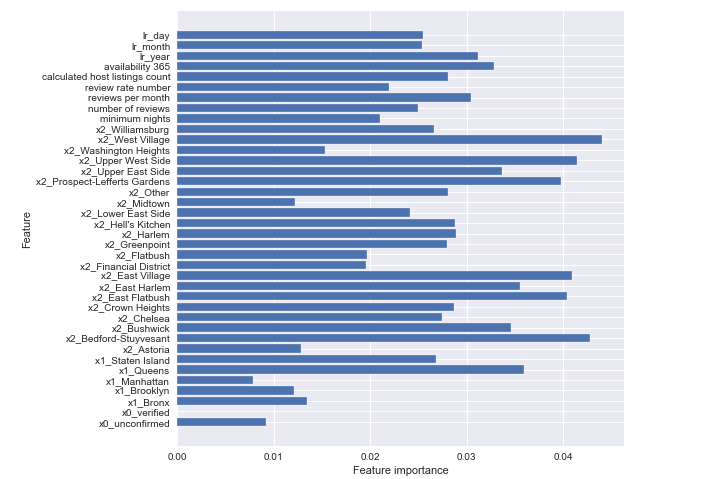

# Predicting the Airbnb Lodgings in New York

**Author**: Alec Hing


## Busness Problem

Many customers are disgrunted at Airbnb's fees and prices. Where can adjustments be made that will impact the total price. Figuring out what features to focus on can help remedy the issue people have with Airbnb.


## Project Overview

Using a dataset provided by Airbnb, analysis and predictions will be made to understand what effects the total price of an Airbnb. Diving further, questions like, where do people tend to stay most?, how long do they stay there?, does booking at a certain time of year effect price?, where would be the most affordable place to book a Airbnb?,and what is the average price for a stay? will be addressed. Regressor tree models will be used to predict price of future Airbnbs as well. The best model is able to predict an Airbnb price with a RMSE of 39.71. In the end some results were to be expected but some also came with a surprice. It was no surprise that people stayed the longest in Manhattan or that service fees affected the total price the most. But what was surprising to me at least was that Bedford-Stuyvesant was the neighborhood that people stayed at the most. Upper East Side, Astoria, Prospect-Lefferts Gardens, and East Village were the locations that was deemed the most affordable. Finally, people like to stay on average 1-2 nights at Airbnb.

## The Data

The dataset used in this project was found on [Kaggle](https://www.kaggle.com/datasets/arianazmoudeh/airbnbopendata).

Data analyzed is from the years 2012 to 2022.
After cleaning data, over 86,000 bookings were analyzed.

The following variables were considered in this analysis:

* 'host_identity_verified'
* 'neighbourhood group'
* 'neighbourhood'
* 'price'
* 'service fee'
* 'minimum nights'
* 'number of reviews'
* 'reviews per month'
* 'review rate number'
* 'calculated host listings count'
* 'availability 365'
* 'lr_year'
* 'lr_month'
* 'lr_day'


## Approach

Important information that needed to be investigated:
* Where do people tend to stay the most?
* How long do stay at an Airbnb?
* Does booking at a certain time of year affect the price?
* Where would be the most affordable place to book an Airbnb?
* What is the average price people spend on an Airbnb?

Answering these questions will help paint a better picture of what people are looking for when they book a lodging and help predict where they most likely will stay in New York.

OLS regression results will help show which variables affect the total price the most and show the average cost for a person. This will also help show which neighborhoods people might want to stay at for a better deal.

Several regressor tree models were used to find the best model that would predict the total price for a stay at a certain place in New York. These models include a basline regerssor model, a random forest model with different interations in its parameters with Grid Search, and a XG Boost model with Grid Search also applied to it.

Finally, making adjustments to the best model will help show which featuers also play a roll in affecting price. In this project's case, service fee is removed along with lesser features that do not have a great importance to really see that features that matter.


## Results

Out of the 6 different iteration of models used in this project, the one with the lowest RMSE value was XG Boost. This had a RMSE of about 39.71, meaning the predicted price of an Airbnb would be about 39.71 off from the actual value. The other models had values well over 40. Furthermore, predictably the service fee variable was highly correlated to the total price of an Airbnb. Our best model suggests that being available 365 days a year will have an effect on the price of an Airbnb over someone is not. Futhermore, The number of reviews an Airbnb receives every month will also effect the price accoring to the XG Boost model. Finally, the areas that have the biggest pull on the finaly price is West Village, Bedford- Stuyvesant, and Upper West Side.


## Recommendations

The biggest concern by customers has been Airbnb's fees. From the results, I learned that service fee plays the biggest role in the final price; reducing this cost could lead to more customers.
Consider focusing business efforts mostly in the Manhattan and Brooklyn area since the model suggests bookings here affect the price the most. These areas are also where most people like to visit.
Another major factor that should be focused on is hosts being available all year round.
Finally, adding incentives for people to give frequent reviews of Airbnbs plays a big role in final price. The model shows that a place that receives more reviews every month will have it's price effected more than one that does not.

### Most popular neighborhoods:


Other here represents all combined neighborhoods under 1000 visits.


### Average Price of Airbnb by Neighborhood (Sorted by longest stay)


### Minimum Nights Most People Stay For




### Feauture importance with Service Fee



The RMSE for this model with service fee as feature in it is 39.71. As you can see, service fee overpowers the rest of the features. The next model takes service fee out to see what other features may matter.

### Feauture importance without Service Fee



Top 6 features according to this chart are West Village, Bedford-Stuyvesant, Upper West Side, East Village, East Flatbush, Prospect-Lefferts Gardens. Among the continuous data the top features seem to be availability_365, lr_year, reviews per month, and calculated host listings count

## Conclusion

After analyzing this dataset from Airbnb, I got a clearer picture of what customers prefer and what effects the total price. To start off with, here is some general information. The most stayed at neighborhood seemed to be Bedford-Stuyvesant (Bed-Stuy) in Brooklyn. Secondly, some of the most expensive neighborhoods people stay at on average are Flatbush, West Willage, East Flatbush, Prospect-Lefferts Gardens, and Astoria. People tend to stay their longest visits in Upper East Side (11.5) days, Upper West Side, Midtown, Chelsea, and Hell's Kitchen. Building off that, the data suggests that people spend the longest stays in Manhattan on average compared to the rest of New York's boroughs. Speaking of booking, the amount of nights people tend to stay at a location is 1-2 nights. Diving further into the data, a OLS Regression chart was created. From this, it was seen that the average price for an Airbnb amongst customers was $89. The neighborhoods that someone could stay at for a cheaper price are Upper East Side, Astoria, Prospect-Lefferts Gardens, and East Village. Finally, it seems that the service fee for these stays predictably affect the total price the most for an Airbnb. Finally the data was applied to several regressor tree models. Those being a baseline one, random forest with different number of estimators, random forest with a grid search applied, and a XG Boost model with Grid Search. Among these variations, the model with the lowest RMSE was XG Boost with a value of 39.71. The features that Airbnb should focus on to adjust the total price are Service fee, availability 365 days a year, and having reviews for a place every month.
From all this data collected, one can say people tend to use Airbnbs to stay in Manhattan and their visits are longer than anywhere else. If one wanted to stay at the most affordable areas, they would want to stay in either Upper East Side, Astoria, Prospect-Lefferts Gardens, and East Village. Finally, the host of these Airbnbs should expect the average person to stay 1-2 nights.


## For More Information

For any additional questions, please contact **Alec @ ahing619@gmail.com**
Full analysis of this project is in a [Jupyter notebook](./ny_borough_prediction.ipynb) or in the [presentation](./Capstone_Presentation.pdf)

## Repository Structure

```
├── data                                <- Sourced externally 
├── images                              <- Created manually 
├── ny_borough_prediction.ipynb         <- Analysis in of this project in Jupyter notebook
├── Capstone_Presentation.pdf           <- Non- Technical PDF version of project presentation
└── README.md                           <- Overview of what this project entails and its results